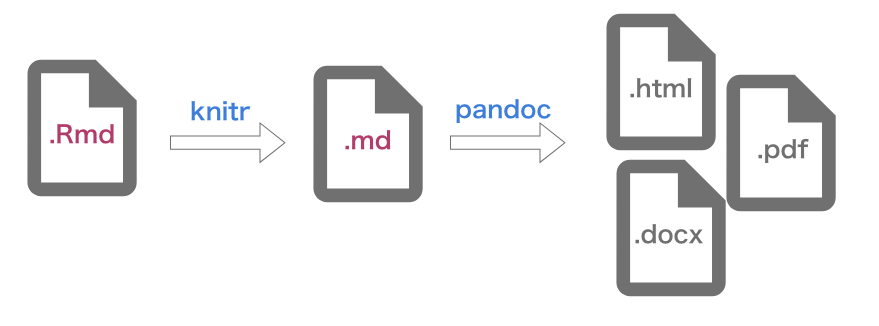

```{r setup, include=FALSE}
knitr::opts_chunk$set(echo = TRUE)
```

## R Markdownとは？

**このドキュメント**はR Markdownで作成されています。

基本的な記法は一般的なMarkdownと同様ですが、`knitr`パッケージの力によってすべての**コードチャンク**を実行した上で`.md`ファイルを生成し、さらに**pandoc**の力によってhtmlやpdf、MS Wordといった各種形式のドキュメントを生成することができます。



いま、このファイルをRSstudioで開いているとすると、エディタ上部に**Knit**というボタンが有ると思います。一思いに押してみましょう。

htmlファイルが生成されたと思います。中身を確認してみて下さい。

## コードチャンクの実行

次に示すのは**コードチャンク**と呼ばれるものです。いわゆるfanced code blockですが、この中に記述されたコードは実行されます。htmlファイルの中には実行結果が表示されていると思います。

```{r cars}
summary(cars)
```

さらに、コードチャンクは編集中でも実行することができます。コードチャンクの右上に再生ボタンのようなアイコンが見えると思います。これをクリックすると、コードの実行結果がインライン表示されます。

## プロットのインライン表示

Rは可視化機能に優れた言語ですが、`plot()`などの関数でプロットを作成した場合、その結果ももちろんインライン表示されます。

```{r pressure, echo=FALSE}
plot(pressure)
```

また、ここでは`echo=FALSE`という引数をコードチャンクに与えていることに注目して下さい。これにより、出力されるhtmlファイルにはコードの実行結果、つまりプロットのみが表示されて、コード自体は含まれない、という状態になります。

このように、コードチャンクは引数による制御に対応しています。

## YAMLヘッダー

R Markdownの冒頭部には、`---`で囲まれた領域があり、ここではYAMLによりファイル全体に関わるようなオプションを指定できます。指定できる内容はドキュメントの種類によって異なります。

例えば`author: "your name"`のように名前を入れた一行を足して、再びKnitしてみてください。出力結果に名前が追加されたはずです。

$\TeX$に馴染みがあれば、プリアンブル部のようなものだと考えると理解しやすいと思います。